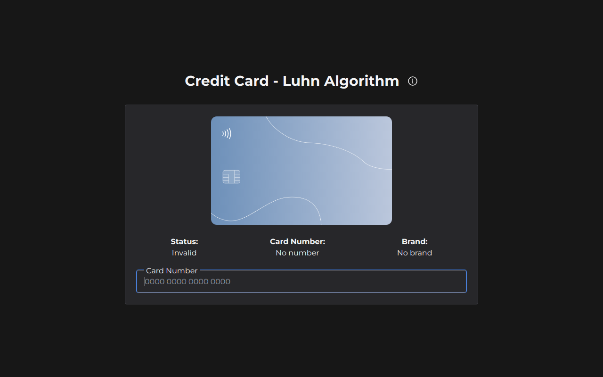

# Credit Card Luhn's Algorithm
Credit card validator that use the Luhn's Algorithm to verify if a credit card number is valid or not.

## 💻 Technologies
- React
- TailwindCSS
- RadixUI

## 📔 What I learned
- Algorithm
- Improve logic
- Math in the programming
- Input masks
